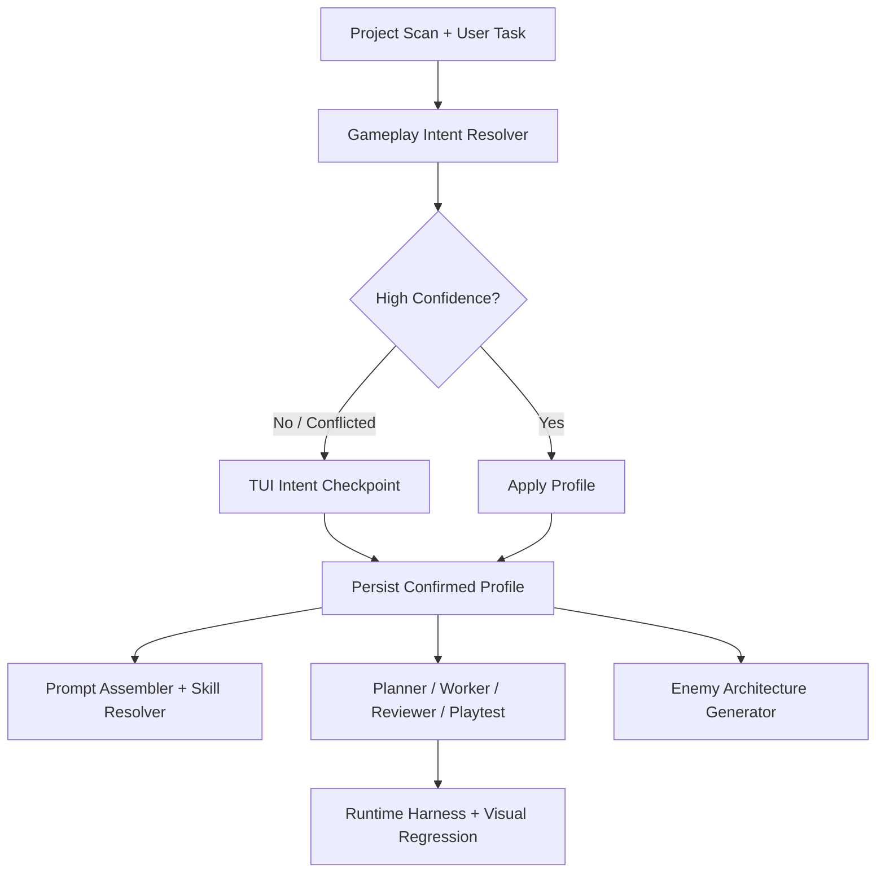

# Gameplay Intent And Enemy AI Roadmap

## Summary

God Code should not rely on ad-hoc prompt guesses to generate enemy behavior for every game. It should:

1. infer the game's gameplay direction from the project and the user's request
2. confirm the direction with the user only when uncertainty is high or signals conflict
3. persist the confirmed gameplay profile into design memory
4. route planning, implementation, review, and playtesting through that profile

This roadmap covers:

- TUI interaction design for intent confirmation
- gameplay-intent inference and persistence
- profile-aware skill selection
- enemy-system generation for different genres
- validation and playtest upgrades

## Problem Statement

Current behavior is too open-ended for cross-genre gameplay work:

- the system can infer collision and physics concerns, but it does not infer a stable gameplay profile
- internal skills only cover `collision` and `physics`
- design memory stores broad project notes, but not structured genre/combat/enemy profiles
- the agent stack has planner/worker/reviewer/playtest roles, but no shared gameplay-intent contract
- enemy behavior generation risks drifting between genres when a project sends mixed signals

The `starfall_demo` case illustrates the problem:

- the project presents as a shooter
- some content still suggests a turret-defense direction
- enemy logic is actually hard-coded scripted movement rather than a reusable enemy architecture

Without an explicit gameplay profile, the agent can build the wrong system even if individual edits are locally reasonable.

## Product Goal

God Code should behave like a gameplay-aware engineering assistant:

- infer likely game direction automatically
- ask short, high-signal questions only when needed
- store the chosen direction persistently
- generate enemy systems appropriate to the genre instead of producing a one-size-fits-all AI

## Core Principles

### 1. Infer first, ask second

The agent should first inspect:

- project structure
- `project.godot` input map
- scenes and script naming
- design memory
- current user task

It should ask follow-up questions only when:

- confidence is low
- signals conflict
- the requested change has architecture-level consequences

### 2. Avoid universal enemy AI

There should be no single "enemy AI" abstraction that tries to fit every genre. Instead:

- keep a shared `enemy_core`
- select genre-specific behavior modules
- validate those modules using genre-specific playtest criteria

### 3. Persist design intent

Once the user confirms a direction, the system must reuse it:

- across the current session
- across resumed sessions
- across planner, worker, reviewer, and playtest passes

### 4. Make the TUI operational

Intent questions should be part of the working session, not free-form chat noise:

- short questions
- constrained answers
- explicit confirmation state
- visible current profile in the workspace

## Target Architecture



## TUI Interaction Design

## Goals

- keep chat momentum
- reduce wrong architectural assumptions
- avoid long onboarding questionnaires

## New Concepts

### Gameplay Profile

Resolved per project and refined per task:

```json
{
  "genre": "bullet_hell",
  "camera_model": "vertical_scroller",
  "player_control_model": "free_2d_dodge",
  "combat_model": "pattern_survival",
  "enemy_model": "scripted_patterns",
  "boss_model": "phase_based",
  "testing_focus": [
    "wave_timing",
    "pattern_readability",
    "boss_phase_clear"
  ],
  "confidence": 0.82,
  "conflicts": []
}
```

### Intent Checkpoint

A lightweight TUI checkpoint shown only when intent is uncertain or conflicted.

## Trigger Rules

Show an `Intent Checkpoint` when any of the following are true:

- no confirmed gameplay profile exists for the project
- resolver confidence is below a threshold such as `0.75`
- multiple genre signals conflict
- the task changes enemy systems, boss systems, combat systems, or controls
- design memory contradicts project structure or user prompt

Do not interrupt the user for:

- simple bug fixes
- formatting or naming changes
- localized scene edits with no gameplay impact

## Workspace Changes

Add an `Intent` panel to the current workspace layout in [display.py](/Users/chuisiufai/Projects/god-code/godot_agent/tui/display.py):

- `Genre`
- `Combat`
- `Enemy Model`
- `Boss Model`
- `Confidence`
- `Open Questions`

If unresolved, show a highlighted warning such as:

`Intent unresolved: shooter and tower-defense signals conflict`

## Command Design

Add dedicated commands:

- `/intent`
- `/intent status`
- `/intent confirm`
- `/intent edit`
- `/intent clear`

Optional later additions:

- `/intent auto`
- `/intent questions`
- `/intent profile`

### `/intent`

Shows the currently inferred and confirmed profile, including:

- active values
- confidence
- unresolved conflicts
- source of each value: inferred vs confirmed

### `/intent confirm`

Accepts the current inferred profile and writes it to design memory.

### `/intent edit`

Opens a short guided flow to edit key profile values.

### `/intent clear`

Clears the confirmed profile so the resolver can infer again on the next high-impact turn.

## Question Style

Questions should be short, high-signal, and choice-oriented.

Good:

- "This project reads as `bullet hell shooter`. Keep that direction?"
- "Should enemies be `scripted patterns` or `reactive chase AI`?"
- "Should the player move `left-right only` or `free 2D dodge`?"

Bad:

- "Describe your gameplay vision in detail."
- "What should enemy AI be like?"

## Interaction Flow

### High-confidence path

1. scan project
2. infer gameplay profile
3. show `Intent` panel silently
4. proceed with work

### Low-confidence path

1. scan project
2. infer gameplay profile with conflicts
3. show `Intent Checkpoint`
4. ask 1 to 3 questions
5. persist confirmed profile
6. continue work

## Resolver Design

Create a new module:

- `/Users/chuisiufai/Projects/god-code/godot_agent/runtime/intent_resolver.py`

Responsibilities:

- inspect project metadata and task text
- produce a structured gameplay profile
- score confidence
- list conflicts
- explain why the profile was inferred

## Inputs

- current user message
- project scan results
- `project.godot`
- design memory
- active files modified recently

## Heuristic Signals

Examples:

- input actions: `shoot`, `bomb`, `focus`, `dash`, `interact`
- file names: `enemy`, `wave`, `boss`, `tower`, `patrol`, `guard`
- scene names: `hud`, `inventory`, `arena`, `level`, `dialog`
- design memory notes: `bullet hell`, `tower defense`, `roguelite`

## Output Contract

Suggested dataclass:

```python
@dataclass
class GameplayIntentProfile:
    genre: str = ""
    camera_model: str = ""
    player_control_model: str = ""
    combat_model: str = ""
    enemy_model: str = ""
    boss_model: str = ""
    testing_focus: list[str] = field(default_factory=list)
    confidence: float = 0.0
    conflicts: list[str] = field(default_factory=list)
    reasons: list[str] = field(default_factory=list)
    confirmed: bool = False
```

## Design Memory Expansion

Extend [design_memory.py](/Users/chuisiufai/Projects/god-code/godot_agent/runtime/design_memory.py) with structured intent fields:

- `genre_profile`
- `camera_profile`
- `player_control_profile`
- `combat_profile`
- `enemy_profile`
- `boss_profile`
- `testing_profile`
- `intent_conflicts`
- `intent_notes`

Existing broad fields such as `pillars` and `mechanic_notes` remain useful, but they should no longer carry the full burden of gameplay intent.

## Prompt And Skill Integration

## Prompt Assembler

Update the prompt builder so the system prompt includes:

- inferred profile if unconfirmed
- confirmed profile if available
- outstanding conflicts if not yet resolved

The gameplay profile should be treated as a first-class prompt section, alongside the existing Godot playbook and skills.

## Skill Strategy

Do not add a generic `enemy_ai` skill first.

Add profile-aware skills:

- `bullet_hell`
- `topdown_shooter`
- `platformer_enemy`
- `tower_defense`
- `stealth_guard`

Keep existing foundational skills:

- `collision`
- `physics`

### Why this split matters

Enemy design differs by genre:

- bullet hell uses scripted paths, spawn choreography, and pattern readability
- platformers use patrol/chase/attack state transitions and edge awareness
- tower defense uses pathing, range checks, and target selection
- stealth uses line-of-sight, alert state, and search behavior

These are not interchangeable behaviors under a single abstract enemy-AI template.

## Enemy Architecture Strategy

## Shared Layer: `enemy_core`

Reusable across genres:

- HP
- hit and death handling
- score and drops
- collision and hurtbox logic
- basic lifecycle hooks
- boss phase hooks

## Genre-Specific Layers

### Bullet hell

- `movement_pattern`
- `fire_pattern`
- `encounter_director`
- `boss_phase_controller`

### Platformer combat

- `state_machine`
- `patrol/chase/attack`
- `edge and floor awareness`
- `hurt and knockback response`

### Tower defense

- `path follower`
- `target priority`
- `range and fire cadence`
- `wave composer`

### Stealth

- `perception module`
- `alert/search/combat state machine`
- `cover or patrol behavior`

## Important Rule

God Code should generate the right enemy architecture for the current gameplay profile, not a universal enemy AI.

## Agent Behavior Changes

The current built-in agents in [configs.py](/Users/chuisiufai/Projects/god-code/godot_agent/agents/configs.py) should all consume the same gameplay profile.

### Planner

- identify gameplay profile
- list risks of the requested system within that profile
- choose the correct enemy architecture pattern

### Worker

- implement only profile-compatible systems
- avoid introducing genre drift

### Reviewer

- validate whether the implementation matches the confirmed profile
- flag architecture that belongs to the wrong genre

### Playtest Analyst

- choose scenario checks based on the gameplay profile

No new specialist agent is required in the first phase. Profile-driven behavior should come first.

## Playtest And Validation

Upgrade playtest selection to be profile-aware.

### Bullet hell checks

- wave timing
- spawn formation timing
- boss phase transition behavior
- bullet clear on phase change
- pattern readability
- player dodge space

### Platformer checks

- patrol route correctness
- chase trigger conditions
- edge handling
- attack timing

### Tower defense checks

- lane/path following
- tower target selection
- projectile cadence
- wave composition

### Stealth checks

- LOS correctness
- alert escalation
- search decay
- recovery to patrol

## File-Level Backlog

## P0: Intent Resolver Foundation

Add:

- `/Users/chuisiufai/Projects/god-code/godot_agent/runtime/intent_resolver.py`

Update:

- `/Users/chuisiufai/Projects/god-code/godot_agent/runtime/design_memory.py`
- `/Users/chuisiufai/Projects/god-code/godot_agent/tools/memory_tool.py`

Acceptance:

- profile inference runs from a project root and user prompt
- profile confidence and conflicts are returned
- confirmed profiles persist in design memory

## P1: TUI Intent UX

Update:

- `/Users/chuisiufai/Projects/god-code/godot_agent/tui/display.py`
- `/Users/chuisiufai/Projects/god-code/godot_agent/tui/input_handler.py`
- `/Users/chuisiufai/Projects/god-code/godot_agent/cli.py`
- `/Users/chuisiufai/Projects/god-code/godot_agent/runtime/events.py`

Acceptance:

- workspace shows an `Intent` panel
- `/intent` commands work
- low-confidence cases trigger short guided questions

## P2: Prompt And Skill Routing

Update:

- `/Users/chuisiufai/Projects/god-code/godot_agent/prompts/assembler.py`
- `/Users/chuisiufai/Projects/god-code/godot_agent/prompts/skill_library.py`
- `/Users/chuisiufai/Projects/god-code/godot_agent/prompts/skill_selector.py`

Add:

- new profile-aware skills

Acceptance:

- correct skill family activates from gameplay profile
- tool narrowing follows the selected genre skill

## P3: Enemy Architecture Generator

Update:

- `/Users/chuisiufai/Projects/god-code/godot_agent/godot/pattern_advisor.py`
- `/Users/chuisiufai/Projects/god-code/godot_agent/runtime/engine.py`

Add:

- architecture templates or generation helpers for:
  - `enemy_core`
  - `movement_pattern`
  - `fire_pattern`
  - `phase_controller`

Acceptance:

- implementation plans and edits are profile-compatible
- bullet-hell requests no longer default to generic chase AI

## P4: Profile-Aware Playtest

Update:

- `/Users/chuisiufai/Projects/god-code/godot_agent/runtime/playtest_harness.py`
- `/Users/chuisiufai/Projects/god-code/godot_agent/testing/scenario_runner.py`
- `/Users/chuisiufai/Projects/god-code/godot_agent/runtime/scenario_specs/*`

Acceptance:

- playtest scenarios are selected by gameplay profile
- reports clearly reference the intended profile

## P5: Documentation And Examples

Update:

- `/Users/chuisiufai/Projects/god-code/README.md`
- `/Users/chuisiufai/Projects/god-code/CHANGELOG.md`

Add:

- example profiles
- example TUI flows
- example genre skill behavior

Acceptance:

- users can understand when the agent will ask intent questions
- users can explicitly steer genre/profile behavior

## Test Plan

Add tests for:

- intent inference from project metadata
- conflict detection from mixed signals
- `/intent` command parsing and TUI display
- design-memory profile persistence
- profile-aware skill selection
- profile-aware playtest selection

Suggested files:

- `/Users/chuisiufai/Projects/god-code/tests/runtime/test_intent_resolver.py`
- `/Users/chuisiufai/Projects/god-code/tests/runtime/test_design_memory.py`
- `/Users/chuisiufai/Projects/god-code/tests/tui/test_input_handler.py`
- `/Users/chuisiufai/Projects/god-code/tests/tui/test_display.py`
- `/Users/chuisiufai/Projects/god-code/tests/prompts/test_skill_selector.py`
- `/Users/chuisiufai/Projects/god-code/tests/runtime/test_playtest_harness.py`

## Initial Implementation Recommendation

Do this first:

1. `P0` intent resolver
2. `P1` TUI intent checkpoint
3. structured design-memory persistence

That sequence gives the system a stable gameplay direction before adding more genre-specialized skills.

Do not start with:

- a universal enemy-AI abstraction
- many new specialist agents
- free-form long questionnaires

## Example: `starfall_demo`

For the `starfall_demo` project, the system should infer something like:

- `genre`: `bullet_hell` or `topdown_shooter`
- `combat_model`: `pattern_survival`
- `enemy_model`: `scripted_patterns`
- `boss_model`: `phase_based`

It should then ask only if conflict exists, for example:

- "This project looks like a shooter, but some text and input still suggest turret-defense. Which direction should I follow?"

That answer should become persistent project intent and drive subsequent enemy-system work.

## End State

When this roadmap is complete, God Code should:

- infer gameplay direction automatically
- ask focused questions only when needed
- remember confirmed project direction
- generate enemy systems appropriate to the current genre
- validate gameplay using the right test criteria for that genre

That is the right long-term path for handling many different game types without collapsing into either rigid templates or prompt-only guesswork.
